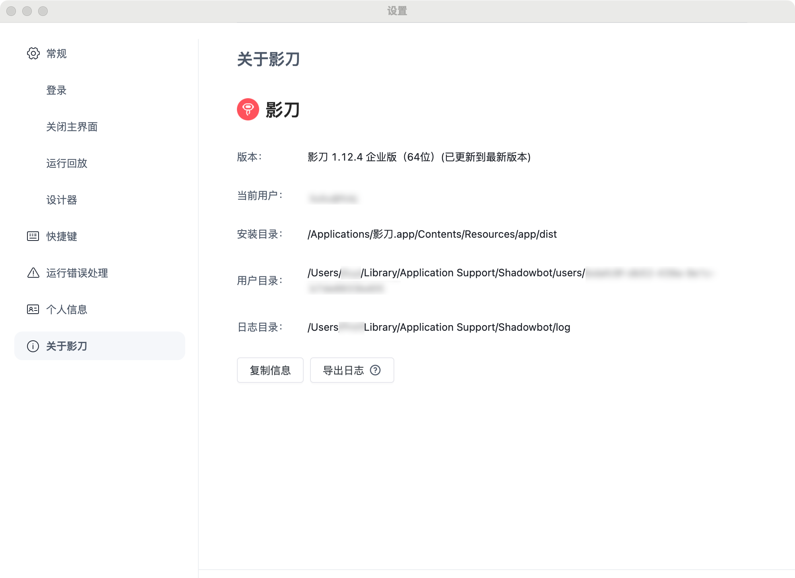

<p>
  
</p>

# 影刀RPA MCP Server

[影刀RPA](https://www.yingdao.com):一个RPA低代码平台，一款人人可用的RPA自动化产品，能够将人从重复的劳动中解放出来。
<br/>
[影刀AI Power](https://www.yingdao.com/ai-power):一个AI低代码平台，能够快速创建AI智能体、AI工作流，帮助用户把AI用起来。

影刀 RPA MCP Server 基于 Model Context Protocol (MCP) 实现，为影刀AI Power及其他可作为MCP Host的工具(如 Claude Desktop、Cursor 等)提供调用RPA的能力。

同时支持SSE Server与Stdio Server两种模式。

<a href="https://glama.ai/mcp/servers/@ying-dao/yingdao_mcp_server">
  
</a>

# 如何开始
支持两种方式来运行影刀RPA
## 本地模式
设置环境变量
注意：本地模式下，智能获取并运行“我获取的应用”并已经被至少执行过一次的应用
```bash
RPA_MODEL=local
SHADOWBOT_PATH={your_shadowbot_path} //影刀rpa的exe路径
USER_FOLDER={your_user_folder}       //影刀rpa的用户文件夹路径
```
### 影刀RPA的exe路径
Windows
注意：windows下在AI Power客户端中，路径要使用双斜杠
```bash
D://Program Files//{安装目录}//ShadowBot.exe
```

Mac

```bash
/Applications/影刀.app
```

### 影刀RPA的用户文件夹路径
在影刀RPA的设置中，找用户文件夹选项
<p></p>


## 开放API模式 (仅支持企业用户)
设置环境变量

```bash
RPA_MODEL=openApi
ACCESS_KEY_ID={your_access_key_id}
ACCESS_KEY_SECRET={your_access_key_secret}
```

### 获取方式
企业管理员登录影刀RPA控制台获取，请参考[影刀RPA帮助文档-鉴权](https://www.yingdao.com/yddoc/rpa/710499792859115520)

# Stdio Server启动
在客户端中配置
```json
{
  "mcpServers": {
    "YingDao RPA MCP Server": {
      "command": "npx",
      "args": ["-y", "yingdao-mcp-server"],
      "env":{
        "RPA_MODEL":"openApi",
        "ACCESS_KEY_ID":"{your_access_key_id}",
        "ACCESS_KEY_SECRET":"{your_access_key_secret}"
      }
    }
  }
}
```
# SSE Server配置

## 构建

Clone the repository and build:

```bash
git clone https://github.com/ying-dao/yingdao_mcp_server.git
cd yingdao_mcp_server
npm install
npm run build
```

## 配置
添加.env文件，配置项参考以上描述

## 启动
```bash
npm run start:server
```
## 客户端配置
AI Power 客户端配置
```json
{
  "mcpServers": {
    "YingDao RPA MCP Server": {
      "url": "http://localhost:3000/sse",
      "description": "影刀 MCP Server"
    }
  }
}
```
默认端口为3000

# 能力
## 本地模式
1. **queryRobotParam**: 查询RPA应用的参数
2. **queryApplist**: 查询RPA应用的列表
3. **runApp**: 运行RPA应用

## 开放API模式
1. **uploadFile**: 上传文件到RPA平台
2. **queryRobotParam**: 查询RPA应用参数
3. **queryApplist**: 获取分页RPA应用列表
4. **startJob**: 启动RPA作业
5. **queryJob**: 查询RPA作业状态
6. **queryClientList**: 查询调度RPA机器人列表

### License
MIT